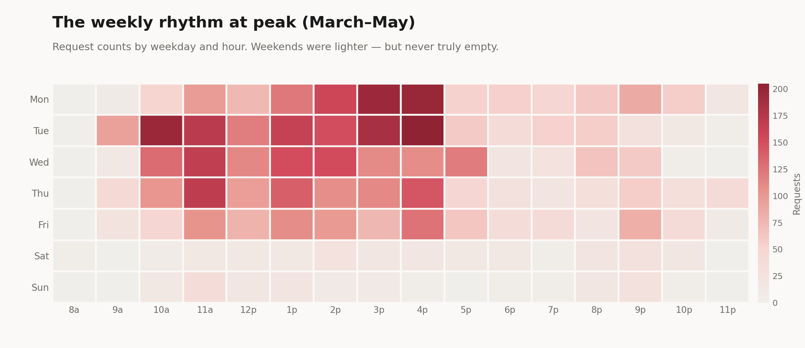

#### Black May

In May of this year, after a heavy few weeks, grinding away at Relay and the UR agents, I checked my usage in Cursor and found that I'd used over $3,800 in tokens. "Oh shit," I thought to myself, "oh fuck."

After ruling out options related to 'getting away with it', I decided I had to tell on myself. I messaged GH, head hung low, and after a few minutes that felt like hours, I heard back. Instead of being fired, banned from AI, or otherwise censured for my crimes, what I got back was GH's signature cool-calm-and-collected practicality. Phew.

#### My Own Personal MAX Mode

Despite the measured response from management, I was feeling seriously guilty for going so overboard. I thought a lot about how I let that happen. I have ADHD — an upside to that is that I tend to hyperfocus given the right conditions. It turns out that suddenly being able to directly build plausible things after years of only being able to influence development is one of those conditions.

Suddenly, I had let down my PM armor. Isn't saying 'no' my whole thing, where did that go? Every idea felt so right. An agentic memory system with temporal decay — let's go. A 3D visualization of embedded feature request clusters — ship it. The wall between conception and implementation was seemingly shattered.

Every idea became a session, each session just one more turn from completion. But that final turn came rarely. Issues would spin, one prompt after the next. Whole features tossed out and rebuilt after hitting some unforeseen blocker. All of this a consequence of moving too fast, too uncritically. I was a runaway train, building cool stuff, sure, but expensive and unsustainable.

Spread so thinly, I started delegating uniquely human skills — the stuff that only comes out of a hot, wet, organic brain. I was spending more tokens because I had no breaks, and neither did the tool that I was using.

#### Zen and the Art of Token Management

Looking back on my usage from those runaway months, a few things stand out. Yes I was using high-end models, yes I was overusing Cursor's MAX mode, but those problems were the result of something more abstract: a lack of feedback. Using Cursor we have unlimited access to models, but the catch is they are billed per-token at their API rates. Instead of watching a meter fill throughout the day, the only feedback I got as a user was when I occasionally checked my usage, buried deep in settings.

On the other hand, subscriptions like Claude charge a consistent monthly rate reflecting the average usage across all users. Here power users have a huge advantage as they become subsidized by the masses of casual users. This subsidized usage comes with a compromise though: a 5-hour and a weekly limit. When I first switched over to Claude I came in with my existing habits from Cursor. I'd spin up five or six parallel projects and boom, 45 minutes later I was locked down. The difference was that, this time, there was a clear, visible meter filling up as I worked. Gradually, I adapted to the feedback mechanism of that 5-hour meter filling up. I started focusing on fewer threads at a time, reserving Opus for actually complex tasks, and putting more time into my prompts and context. Instead of the brute force one-million-monkeys-at-a-typewriter approach, just prompting over and over until something worked, the realtime token scarcity gave me the opportunity to apply more of my human self to problems.

As talk of automation and agentic AI gets louder and louder, that human application to the AI workflow has been a central and evolving topic. The, fairly reckless, idea of 'human in the loop' has, for many of the reasons discussed above, given way to the more measured concept of 'human at the helm'. A person being 'in the loop' implies rubber stamping; smashing 'enter' every few minutes while the LLM has its way with a project. The idea of 'human at the helm' places the responsibility back on the human. Helmsman in Greek is 'kubernetes'. This is the origin of the word cybernetics, the post-WW2 science of systems and feedback loops and a direct ancestor of AI and machine learning. The idea is that a helmsman isn't directly steering a ship, instead he is a 'governor' whose movement of the wheel is part of a system made up of the rudder, the ship, the wind, and the water. The system's own output — direction and speed — is the feedback that lets the governor know to change its inputs. Using Cursor with no meter was like steering a ship without knowing its current course.
